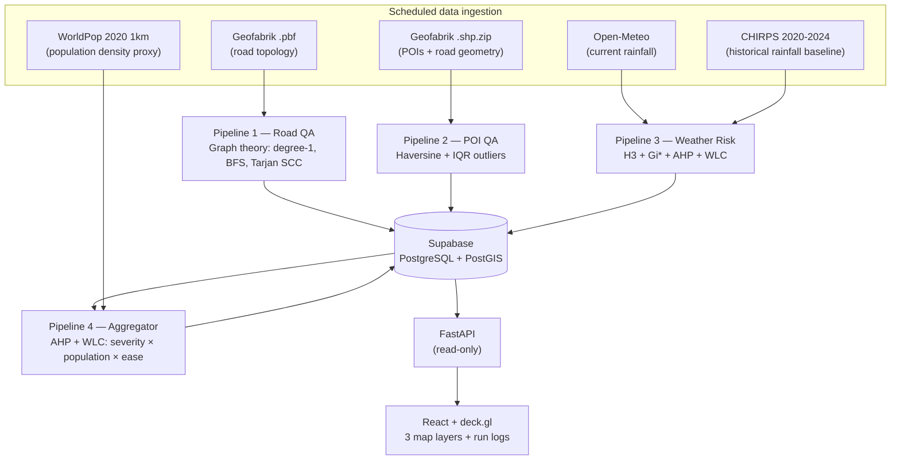

# GeoLogix AI — Geospatial QA & Weather Risk Mapping for Greater Jakarta

GeoLogix is an automated geospatial pipeline that checks OpenStreetMap data quality, estimates weather-related risk across Greater Jakarta, and ranks findings by priority.

The system runs on a schedule through GitHub Actions. Results are stored in PostgreSQL/PostGIS and exposed through a web dashboard.

**Live demo**

* Dashboard: **https://geologix.vercel.app**
* API: **https://geologix-api.onrender.com** (`/docs` for API documentation)

> **Note:** The API runs on Render's free tier. After a period of inactivity, the first request can take around a minute because of a cold start. Refresh the dashboard if data does not appear immediately.

---

## Why the system is built this way

The main design rule is simple:

> **Use the simplest method that can be justified, and only move to something more complex when there is a reason to.**

Not every geospatial problem needs machine learning.

* Road topology errors are **graph problems**, so the road QA pipeline uses deterministic graph algorithms.
* POI location anomalies are treated as a **distance-distribution problem**, using a transparent IQR-based rule.
* Weather risk is a **multi-criteria spatial problem**, so the system uses AHP, WLC, and Getis-Ord Gi* rather than an arbitrary combined score.
* **Machine learning is intentionally not used yet.** The current rule-based system needs to run for a few months first so it can build a meaningful historical dataset with reviewed outcomes. Only then does it make sense to train and compare an ML model against the existing baseline.

Every formula is implemented from the project's mathematical specification (SPEC, Section 3), covered by unit tests against hand-calculated or analytical values, and checked against live OSM data during validation.

---

## Architecture



The two OSM data sources are intentionally kept separate.

The `.pbf` extract is used by Pipeline 1 because it needs the full road topology and is processed with osmium + OSMnx. Pipeline 2 uses the `.shp.zip` extract because it only needs POI and road geometries and can be handled directly with GeoPandas.

Keeping them separate also avoids mixing filters between the two pipelines, which can otherwise introduce false positives.

---

# Pipelines

## 1. Road Network QA

Pipeline 1 treats the road network as a graph and looks for structural anomalies.

| Check                  | Method                                                | Why                                                                                                                     |   |      |         |                                                                                           |
| ---------------------- | ----------------------------------------------------- | ----------------------------------------------------------------------------------------------------------------------- | - | ---- | ------- | ----------------------------------------------------------------------------------------- |
| Dangling node          | `degree(v) = 1` on an undirected/collapsed graph      | A hanging road end can indicate a broken digitization. The rule is deterministic and does not require threshold tuning. |   |      |         |                                                                                           |
| Disconnected component | BFS connected components, keeping components where `  | Ci                                                                                                                      | / | Cmax | < 0.05` | Small isolated components may indicate roads that are disconnected from the main network. |
| Oneway inconsistency   | Tarjan SCC; flag oneway edges crossing SCC boundaries | A one-way edge without a corresponding route back can indicate an incorrect direction tag or missing reverse mapping.   |   |      |         |                                                                                           |

### Full-area run

The first full Greater Jakarta run in CI, on **19 July 2026**, processed:

* **703,926 nodes**
* **1,708,734 edges**
* Standard GitHub Actions runner

The initial run produced roughly **180,000 dangling-node candidates (26% of nodes)**.

That number was clearly too high to treat as actual errors. Most candidates were either real residential dead ends or artifacts caused by clipping the network at the study-area boundary.

The response was to separate **detection** from **what gets persisted as a finding**:

1. Remove dangling nodes created by the Greater Jakarta boundary.
2. Persist `major` dangling findings only on arterial-class roads (`motorway` through `tertiary`, including links).

This keeps the detector itself intact while making the output useful for review.

After filtering, the first run produced:

* **16 persisted dangling findings**
* **315 disconnected components**
* **405 oneway findings**

The distinction matters: these are review candidates, not automatic claims that the OSM data is wrong.

---

## 2. POI Validation

Pipeline 2 checks whether POIs are unusually far from mapped roads.

For each POI, the distance to the nearest road is calculated using the Haversine formula with an Earth radius of **6.371 km**.

Outliers are detected using the Tukey upper fence:

`Q3 + 1.5 × IQR`

IQR was chosen because the distance distribution is right-skewed. A mean/std-based threshold would be more affected by the long tail.

### Full-area result

The first full-area CI run on **19 July 2026** processed:

* **46,979 POIs**
* **745,268 road segments**
* **2,072 outliers (4.4%)**
* Q1: **8.71 m**
* Q3: **22.83 m**
* Upper fence: **44.0 m**

The result was broadly consistent with the district-level sample used during development (Menteng: **4.4% vs 3.8%**).

Each flagged POI also gets a `confidence_score` based on how far it falls beyond the Tukey fence, normalized from 0 to 1.

---

## 3. Weather Risk

Pipeline 3 combines current rainfall with historical rainfall patterns to produce a spatial risk surface.

### 1. H3 grid

The study area is divided into **H3 resolution 7**, resulting in **1,079 cells** across Greater Jakarta.

Each cell covers roughly **5.2 km²**.

This resolution was chosen because the underlying weather data has a much coarser spatial resolution (roughly 11–25 km). Going to a much finer grid would create more detail without necessarily adding more information.

### 2. Current rainfall

Current rainfall is retrieved from Open-Meteo for each H3 cell center.

### 3. Historical rainfall hotspots

Historical rainfall from **CHIRPS 2020–2024** is analyzed using **Getis-Ord Gi***.

The goal is to identify statistically significant clusters rather than simply highlight areas with high rainfall values.

Cells with **p < 0.05** are classified as significant hotspots.

### 4. Risk score

Both criteria are Min-Max normalized and weighted using **AHP (Analytic Hierarchy Process)**.

The final score uses **Weighted Linear Combination (WLC)**:

`RiskIndex = Σ wi × xi`

The AHP run produced **CR = 0**, satisfying the required `CR ≤ 0.1`.

### Result

The first full-area result contained:

* **1,079 H3 cells**
* **348 significant hotspots**

The hotspots were concentrated in the southern part of the study area, particularly around southern Depok and Bogor.

The historical rainfall average was:

* Hotspot cells: **4,328 mm/year**
* Non-hotspot cells: **2,662 mm/year**

The spatial pattern is consistent with the known rainfall gradient toward the Bogor highlands rather than appearing as a random artifact.

---

## 4. Aggregator

Pipeline 4 ranks findings from Pipelines 1 and 2 so that the most actionable issues can be reviewed first.

It reuses the AHP + WLC implementation from Pipeline 3 instead of implementing another scoring system.

The three criteria are:

1. **Severity**
2. **Population density** — using WorldPop 2020 1 km data as an impact proxy
3. **Ease of fix** — a 1–5 score assigned by finding type

The pairwise comparison matrix is perfectly consistent, producing exact weights:

`[4/7, 2/7, 1/7]`

with **CR = 0**.

### Validation

During checklist validation, the same Menteng sample was run three times.

The ranking was deterministic, and the top findings matched hand calculations. For example, a POI with confidence 1.0 in a high-population area and maximum ease-of-fix received the expected high priority.

The first full-area run on **20 July 2026** produced **2,945 prioritized findings** with the same weights and consistency ratio.

Weather risk cells are deliberately **not** included in this ranking.

A weather risk score is a continuous environmental signal that changes over time. It does not represent an error that can be fixed, so assigning it a severity/ease-of-fix score would not have a meaningful interpretation.

---

# Automation

This is not a one-off analysis or a dashboard backed by manually generated data.

The pipelines run automatically through GitHub Actions:

| Workflow                | Schedule                                        |
| ----------------------- | ----------------------------------------------- |
| `pipeline-osm-refresh`  | Weekly                                          |
| `pipeline-road-qa`      | Monday / Thursday + triggered after OSM refresh |
| `pipeline-poi-qa`       | Monday / Thursday                               |
| `pipeline-weather-risk` | Every 6 hours                                   |

Every pipeline run writes a record to `pipeline_logs`, including failed runs.

The log contains the pipeline name, status, finding counts, and run details.

Failed runs are intentionally kept instead of being deleted. They are useful for understanding what went wrong and how the system evolved.

The dashboard reads these logs directly from the database, so the automation claim can be checked from the data rather than relying on a screenshot.

The schedules are also intentionally kept within the GitHub Actions budget for a private repository:

* Monthly allowance: **2,000 minutes**
* Planned usage: roughly **1,500 minutes/month**

---

# Validation

Every pipeline follows the same validation checklist before being considered complete:

1. **Three consecutive deterministic runs**
2. **Manual validation against an independent source**
3. **Results written to the database using a consistent schema**

Detailed notes are available in:

```text
tests/validation_notes_pipeline*.md
```

### Pipeline 1

A Menteng sample was checked against the live OSM API.

The graph formulas behaved as expected. The main false positives came from preprocessing rather than the graph algorithms themselves.

One example was a `motorcar=no` alley that was excluded from the `drive` network, making an otherwise valid road end look dangling.

Another case involved a reverse oneway segment falling outside the clipped study polygon.

### Pipeline 2

**32 outliers** were manually reviewed.

Around one third of the area-based outliers were caused by using `representative_point` for polygon POIs.

For example, a large complex can physically touch a road while its representative point is tens of meters away. In one case, Plaza Indonesia had a representative-point distance of **83 m**, while the polygon itself touched the road.

Four out of four point-based POIs checked against live OSM data had correct coordinates, including indoor mall locations and a point in the middle of Bundaran HI.

So an outlier should be interpreted as:

> **"Far from a mapped road"**

not:

> **"Wrong OSM data."**

### Pipeline 3

All formulas were checked against hand calculations.

The resulting geography was also reviewed for plausibility, including the coastal-to-Bogor rainfall gradient and the individual components contributing to high-risk cells.

### Pipeline 4

The top-ranked finding was independently recalculated by hand.

Differences between neighboring ranks could also be explained from the individual criterion weights.

---

# Known Limitations

There are several limitations that are intentionally documented rather than hidden.

### 1. Findings are candidates, not verdicts

The system identifies things worth reviewing.

Detection precision depends heavily on preprocessing, network filters, and clipping decisions—not only on the mathematical formulas.

The validation samples were useful for identifying the main sources of false positives.

### 2. Polygon POI distance uses `representative_point`

For area-based POIs, the distance is measured from the representative point rather than the polygon boundary.

Large complexes next to roads can therefore be flagged.

In the manual sample, this affected roughly **6 of 32** reviewed outliers.

### 3. Aggregator scores are batch-relative

Pipeline 4 uses Min-Max normalization per run.

The ranking within a run is meaningful, but the absolute scores should **not** be compared directly between different runs.

### 4. WorldPop is a proxy

The population layer is based on **2020 WorldPop data at 1 km resolution**.

It is used as a population-density proxy, not as an estimate of the actual 2026 population.

### 5. Gi* hotspots cover 32% of cells

The significant hotspot area is relatively large because the rainfall field has a strong spatial gradient.

The next improvement would be to evaluate multiple-testing correction, such as FDR.

### 6. Historical dangling-node counts are not directly comparable

On **20 July 2026**, the dangling-node persistence policy changed to include the boundary filter and `major` road-class filter.

Counts before and after this change therefore do not have the same semantic meaning.

Consistent accumulation starts from that date.

### 7. Motorcycle-access roads are still an open issue

Roads tagged with:

```text
motorcycle=yes
motorcar=no
```

are currently excluded from the main network filter.

This matters for Jakarta, where motorcycle access can be operationally important.

The decision is documented as an open issue rather than silently ignored.

---

# Real Incidents

These incidents actually happened during development and are intentionally preserved in `pipeline_logs`.

| Incident                                                              | Diagnosis                                                                            | Fix                                                                                                                                 |
| --------------------------------------------------------------------- | ------------------------------------------------------------------------------------ | ----------------------------------------------------------------------------------------------------------------------------------- |
| All workflows failed with `startup_failure` after 0–1 seconds         | GitHub billing-card authorization failed, blocking Actions                           | Learned to check billing when every workflow fails instantly instead of immediately debugging YAML                                  |
| Road QA runner died after 12.5 minutes with no output                 | 16 GB RAM exhausted while parsing the full Greater Jakarta graph                     | Added dynamic swap on the runner, selecting the roomiest mount and capping swap at 16 GB; the pipeline then completed in 57 minutes |
| Open-Meteo returned HTTP 429                                          | The free tier limits requests per location; a burst of 1,079 locations hit the limit | Added batch delays and 429-specific exponential backoff; reduced the schedule to every 6 hours to stay within the daily budget      |
| Open-Meteo `ReadTimeout` in CI                                        | Shared Azure runner IP/network behavior                                              | Added connection and timeout retries to the fetcher                                                                                 |
| First Pipeline 1 database insert failed with `NumericValueOutOfRange` | OSM node IDs exceeded the 32-bit integer range                                       | Changed the ID column to `BigInteger`                                                                                               |
| Empty `CHIRPS_BASE_URL=` in `.env` overrode the default               | `os.environ.get(k, default)` still returns an empty string when the variable exists  | Changed configuration handling to `os.environ.get(...) or default`                                                                  |

These are part of the project's history because they are more useful than pretending the first implementation worked perfectly.

---

# Roadmap: ML

There is no `ml/` directory yet. That's intentional.

The planned ML stage is to classify whether pipeline findings are likely to be valid using:

* Historical pipeline logs
* Spatial and structural features
* Spatial cross-validation
* Comparison against the existing rule-based baseline

The main problem right now is data.

The current pipeline only started producing semantically consistent historical labels after the dangling-node persistence policy changed on **20 July 2026**.

A useful training dataset should therefore accumulate for several months while the automated system continues running.

The plan is to keep the rule-based system as the baseline and only keep an ML model if it actually performs better on held-out validation data.

If ML performs worse, that result should be reported too.

---

# Running Locally

All external datasets used by the project are openly available. No paid API key is required.

```bash
python -m venv .venv
source .venv/bin/activate
# Windows: .venv\Scripts\activate

pip install -r requirements.txt
cp .env.example .env
# Set DATABASE_URL to your PostgreSQL + PostGIS database

# Example pipeline runs
python -m src.pipeline_2_poi_qa --kecamatan Menteng
python -m src.pipeline_3_weather_risk
python -m src.pipeline_1_road_qa --xml <osmium-tags-filter-output>
python -m src.pipeline_4_aggregator

# Tests
python -m pytest

# API
uvicorn src.api.main:app

# Frontend
cd frontend
npm install
npm run dev
```

For details on the Pipeline 1 XML input, see the docstring in `graph_builder.py`.

Production `.pbf` conversion requires `osmium-tool`. It is available on the Ubuntu CI runner; on Windows development environments, the sample workflow can use the Overpass-based path instead.

---

# Repository Structure

```text
src/
├── config.py                  # thresholds, formulas, and paths
├── data_ingestion/            # OSM, Open-Meteo, CHIRPS, WorldPop fetchers
├── pipeline_1_road_qa/        # graph construction + 3 graph detectors
├── pipeline_2_poi_qa/         # spatial join + Haversine + IQR detection
├── pipeline_3_weather_risk/   # H3, normalization, AHP, WLC, Gi*
├── pipeline_4_aggregator/     # finding prioritization using P3 AHP/WLC
├── db/                        # PostGIS models + database writer
└── api/                       # read-only FastAPI API

frontend/                      # React + deck.gl dashboard
.github/workflows/             # scheduled pipeline workflows
tests/                         # 114 unit tests + validation notes
```

---

# Data Sources & Attribution

* Map data: © OpenStreetMap contributors, ODbL, extracted through Geofabrik.
* Current weather: Open-Meteo, CC BY 4.0.
* Historical rainfall: CHIRPS v2.0, Climate Hazards Center, UC Santa Barbara.
* Population: WorldPop 2020 1 km UN-adjusted, CC BY 4.0.
* Dashboard basemap: © CARTO and © OpenStreetMap.

---

## Project Status

GeoLogix is currently a working research/engineering prototype rather than a production geospatial QA service.

The main pipelines are automated, tested, and running against full-area Greater Jakarta data. The next major step is to let the system accumulate a longer history of reviewed findings, improve preprocessing and false-positive handling, and then evaluate whether ML can actually outperform the existing deterministic baseline.
