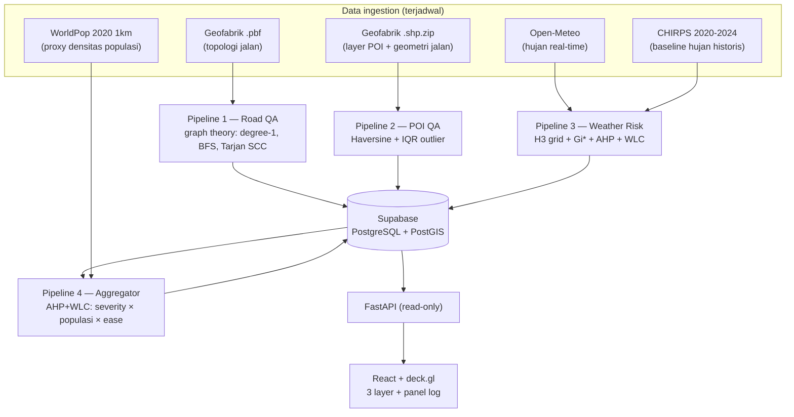

# GeoLogix AI — QA Data Geospasial & Peta Risiko Cuaca Jabodetabek

Sistem pipeline geospasial otomatis yang mengaudit kualitas data peta OpenStreetMap
(jaringan jalan + POI), menghitung peta risiko cuaca per-hexagon, dan memprioritaskan
temuan untuk ditindaklanjuti — berjalan terjadwal via GitHub Actions, tersimpan di
PostgreSQL/PostGIS, dan tervisualisasi di dashboard web.

**Live demo:**
- Dashboard: **https://geologix.vercel.app**
- API: **https://geologix-api.onrender.com** (docs di `/docs`)

> Catatan: backend memakai Render free tier — setelah idle, request pertama
> mengalami *cold start* ±1 menit. Muat ulang kalau data belum muncul.

---

## Kenapa proyek ini dibangun begini (bukan "AI-powered" dari hari pertama)

Prinsip desainnya: **pakai metode paling sederhana yang bisa dipertanggungjawabkan,
dan hanya naik ke metode lebih kompleks kalau ada bukti perlunya.**

- Error topologi jalan (jalan buntu palsu, komponen terputus, oneway tanpa jalur
  balik) adalah masalah **struktur graph** — diselesaikan dengan graph theory
  deterministik, bukan model prediktif.
- Anomali posisi POI adalah masalah **statistik distribusi jarak** — diselesaikan
  dengan IQR yang transparan dan bisa dijelaskan per angka.
- Kerawanan hujan adalah masalah **multi-kriteria spasial** — diselesaikan dengan
  metode MCDA baku (AHP + WLC) dan uji signifikansi spasial (Getis-Ord Gi*),
  bukan skor gabungan sembarang.
- **ML sengaja belum dipakai.** ML baru bermakna setelah sistem rule-based ini
  berjalan otomatis berbulan-bulan dan mengakumulasi log historis berlabel —
  saat itu barulah ada data training dan *baseline* pembanding yang jujur.
  Lihat [Roadmap ML](#roadmap-ml-kenapa-belum-ada-folder-ml).

Setiap rumus di bawah diimplementasikan persis dari spesifikasi matematika proyek
(SPEC Bagian 3), diuji unit test terhadap nilai hitungan tangan/analitik, dan
divalidasi manual terhadap data OSM live.

---

## Arsitektur



Dua sumber OSM **sengaja dipisah**: `.pbf` untuk Pipeline 1 (butuh topologi graph
utuh, dibangun via osmium + OSMnx) dan `.shp.zip` untuk Pipeline 2 (hanya butuh
geometri POI/jalan, dibaca GeoPandas). Mencampur keduanya menimbulkan
inkonsistensi filter yang justru jadi sumber false positive.

---

## Empat pipeline: metode, justifikasi, hasil nyata

### Pipeline 1 — Road Network QA (graph theory)

| Deteksi | Metode | Justifikasi |
|---|---|---|
| Dangling node | degree(v) = 1 pada graph tak-berarah yang di-collapse | Ujung jalan menggantung = kandidat digitasi putus; deterministik, tanpa ambang tuning |
| Disconnected component | BFS connected components, rasio \|Ci\|/\|Cmax\| < 0.05 | Pulau jaringan kecil = kandidat jalan tak tersambung ke jaringan utama |
| Oneway inconsistency | Tarjan SCC; flag edge oneway lintas-SCC | Edge searah tanpa jalur balik = kandidat tag arah salah / jalur balik belum termapping |

Hasil nyata (run full-area Jabodetabek pertama di CI, 19 Jul 2026): graph
**703.926 node / 1.708.734 edge**, diproses di runner GitHub Actions standar
(insiden memori dan penanganannya dicatat di [Insiden](#insiden-nyata--penanganannya)).

**Temuan penting dari run full-area:** ±180 ribu kandidat dangling (26% node) —
mayoritas bukan error, melainkan campuran artefak pemotongan boundary dan
cul-de-sac perumahan asli. Respons: (1) filter boundary Jabodetabek (dangling di
tepi clip dibuang), (2) kebijakan persist `major` — hanya dead-end di kelas jalan
arteri (motorway..tertiary + link) yang disimpan sebagai temuan, karena dead-end
arteri jauh lebih mungkin error nyata daripada ujung gang perumahan. Deteksinya
tetap utuh; yang diseleksi adalah apa yang layak disimpan sebagai *temuan*.
Hasil run pertama pasca-filter: dari 179.582 kandidat dangling, **16** yang
tersimpan (kelas arteri), plus 315 disconnected dan 405 oneway.

### Pipeline 2 — POI Validation (Haversine + IQR)

Jarak tiap POI ke ruas jalan terdekat dihitung Haversine (R = 6.371 km), lalu
outlier dideteksi dengan batas Tukey Q3 + 1.5×IQR. IQR dipilih karena distribusi
jarak *right-skewed* — ambang berbasis mean/stdev akan tertarik ekor distribusi.

Hasil nyata full-area (CI, 19 Jul 2026): **46.979 POI vs 745.268 ruas jalan → 2.072
outlier (4,4%)**, dengan Q1 = 8,71 m, Q3 = 22,83 m, batas atas = 44,0 m — konsisten
dengan statistik sample kecamatan (Menteng: 4,4% vs 3,8%). Tiap outlier membawa
`confidence_score` (gradasi pagar dalam→luar Tukey, 0→1).

### Pipeline 3 — Weather Risk (H3 + Gi* + AHP + WLC)

1. Grid **H3 resolusi 7** (1.079 sel Jabodetabek; ~5,2 km²/sel — dipilih karena
   resolusi model cuaca sumber ~11-25 km, grid lebih halus tidak menambah informasi).
2. Kriteria 1: hujan real-time Open-Meteo per pusat sel.
3. Kriteria 2: **Getis-Ord Gi\*** atas baseline CHIRPS 5 tahun (2020-2024) —
   hotspot hujan historis yang signifikan statistik (p < 0.05), bukan sekadar
   "daerah yang kelihatan basah".
4. Kedua kriteria di-Min-Max, diberi bobot **AHP** (eigenvector; run nyata CR = 0,
   lolos syarat CR ≤ 0.1), digabung **WLC**: RiskIndex = Σ wi·xi.

Hasil nyata: 1.079 sel, **348 hotspot** — semuanya di selatan grid
(Depok selatan/Bogor, mean historis 4.328 vs 2.662 mm/th non-hotspot), konsisten
dengan gradien orografis "Bogor kota hujan". Bukan artefak.

### Pipeline 4 — Aggregator (prioritas lintas-pipeline)

Temuan P1 + P2 diprioritaskan dengan AHP + WLC (reuse modul P3 — bukan
implementasi ulang) atas 3 kriteria: **severity**, **densitas populasi**
(WorldPop 2020 1km — proxy dampak), **ease of fix** (skor 1-5 per jenis error).
Matriks pairwise konsisten sempurna: bobot eksak [4/7, 2/7, 1/7], CR = 0.

Hasil nyata: pada validasi checklist (3× run identik atas sample Menteng),
173 temuan dengan peringkat teratas tervalidasi hitungan tangan (POI confidence
1.0 di pusat kota + ease maksimum); run full-area pertama (20 Jul 2026)
memprioritaskan **2.945 temuan** dengan bobot dan CR identik.
Grid risiko P3 sengaja **tidak** ikut diagregasi: risiko cuaca kontinu per jam,
bukan "error yang bisa diperbaiki" — tidak punya severity/ease yang bermakna.

---

## Bukti berjalan otomatis (bukan screenshot sekali jalan)

- 4 workflow GitHub Actions: `pipeline-osm-refresh` (mingguan, incremental diff
  Geofabrik + fallback full download), `pipeline-road-qa` (Sen/Kam + terpicu
  otomatis setelah refresh via `workflow_run`), `pipeline-poi-qa` (Sen/Kam),
  `pipeline-weather-risk` (per 6 jam).
- Setiap run pipeline menulis baris ke tabel `pipeline_logs` (nama, status,
  jumlah temuan, detail) — termasuk run yang **gagal**. Log kegagalan sengaja
  tidak dihapus: itu jejak insiden dan bahan pelajaran (lihat bawah).
- Panel log di dashboard membaca tabel ini langsung — klaim "otomatis" bisa
  dicek siapa pun dari data, bukan dari kata-kata.
- Jadwal cron dihemat sadar-kuota (repo private = 2.000 menit Actions/bulan;
  total jadwal ±1.500 menit/bulan) — mitigasi yang memang direncanakan di
  spesifikasi risiko proyek.

## Validasi manual (checklist tiap pipeline)

Setiap pipeline lolos checklist yang sama sebelum dianggap selesai:
**3× run berturut-turut deterministik + validasi manual sample terhadap sumber
independen + hasil tersimpan di DB dengan schema konsisten.** Catatan lengkap ada
di `tests/validation_notes_pipeline*.md`. Ringkasan temuan validasi yang jujur:

- **P1 (sample Menteng, dicek ke OSM API live):** rumus-rumusnya benar; false
  positive sample berasal dari **pra-pemrosesan**, bukan algoritma — gang
  `motorcar=no` tak ikut graph `drive` (node tampak dangling padahal jalannya
  ada), dan jalur balik oneway berada di luar polygon yang dipotong.
- **P2 (32 outlier dibedah satu-satu):** ~1/3 outlier area adalah artefak
  `representative_point` (kompleks besar yang tepinya menempel jalan — Plaza
  Indonesia: jarak titik-tengah 83 m, jarak tepi poligon 0 m); 4/4 POI titik
  terkonfirmasi koordinatnya benar di OSM live (indoor mall / tengah Bundaran HI).
  Outlier bermakna "jauh dari jalan termapping", bukan otomatis "salah data".
- **P3:** semua rumus diuji terhadap hitungan tangan; kewajaran geografis dicek
  (gradien pesisir→Bogor, sel risiko tertinggi bisa dijelaskan komponennya).
- **P4:** peringkat 1 dicek hitungan tangan; selisih skor antar-peringkat bisa
  dijelaskan dari bobot per kriteria.

## Keterbatasan yang disadari

1. **Temuan = kandidat review, bukan vonis.** Presisi deteksi ditentukan
   pra-pemrosesan (filter jaringan, pemotongan area), bukan hanya rumus.
   Validasi sample menunjukkan false positive yang tersisa terpetakan sebabnya.
2. **Jarak POI area diukur dari `representative_point`**, bukan tepi poligon —
   kompleks besar yang menempel jalan bisa ikut ter-flag (≈6/32 di sample).
3. **Skor prioritas P4 relatif per batch** (Min-Max per run) — urutan dalam satu
   run yang bermakna; membandingkan angka antar-run tidak.
4. **WorldPop = proyeksi 2020 resolusi 1 km** — proxy densitas, bukan populasi
   aktual 2026.
5. **Hotspot Gi\* mencakup 32% sel** — wilayah signifikan bersambung karena
   gradien orografis kuat; koreksi multiple-testing (FDR) adalah perbaikan lanjutan.
6. **Perubahan kebijakan data 20 Jul 2026:** temuan dangling sebelum vs sesudah
   filter boundary + kelas `major` tidak sebanding — akumulasi log konsisten
   dihitung mulai tanggal ini.
7. Gang `motorcycle=yes motorcar=no` (relevan armada motor Jakarta) belum masuk
   filter jaringan — keputusan terbuka yang tercatat.

## Insiden nyata & penanganannya

Semua insiden di bawah terjadi sungguhan selama pengerjaan, jejaknya sengaja
dibiarkan di `pipeline_logs`:

| Insiden | Diagnosis | Penanganan |
|---|---|---|
| Semua workflow `startup_failure` 0-1 dtk | Otorisasi kartu billing GitHub gagal → Actions diblokir total | Pelajaran: startup_failure seragam & instan = cek billing, bukan YAML |
| Road-QA runner mati 12,5 mnt tanpa output | RAM 16 GB habis saat parse graph Jabodetabek | Swap dinamis di runner (pilih mount terlega, cap 16 GB) → sukses 57 mnt |
| HTTP 429 Open-Meteo | Free tier menghitung per-lokasi (terverifikasi empiris), burst 1.079 lokasi kena limit | Jeda antar-batch + retry backoff khusus 429; cron diturunkan ke per 6 jam agar muat budget harian |
| `ReadTimeout` Open-Meteo dari runner CI | IP Azure shared | Retry timeout/koneksi di fetcher |
| Insert pertama P1 gagal `NumericValueOutOfRange` | ID node OSM > 2³¹ | Kolom ID → BigInteger |
| `.env` berisi `CHIRPS_BASE_URL=` kosong meng-override default | `os.environ.get(k, default)` tidak menolong kalau var ada tapi kosong | Pola `os.environ.get(...) or default` di config |

## Roadmap ML (kenapa belum ada folder `ml/`)

Rencana ML (klasifikasi validitas temuan dari log historis + fitur spasial,
spatial cross-validation, uji lawan baseline non-ML) **sengaja belum dieksekusi**:

- Data training-nya adalah log historis pipeline ini sendiri. Per 20 Jul 2026,
  akumulasi log yang **konsisten secara semantik** (pasca-filter dangling) baru
  dimulai — idealnya butuh 3-6 bulan cron berjalan.
- Tanpa baseline rule-based yang stabil, klaim "ML lebih baik" tidak bisa diuji.
  Model hanya akan dipertahankan **kalau menang dari baseline** pada validasi
  manual; kalau kalah, itu dilaporkan sebagai temuan negatif yang jujur.

## Menjalankan sendiri

Semua sumber data terbuka (OSM/Geofabrik, Open-Meteo, CHIRPS, WorldPop) — tidak
ada API key berbayar.

```bash
python -m venv .venv && source .venv/bin/activate   # Windows: .venv\Scripts\activate
pip install -r requirements.txt
cp .env.example .env    # isi DATABASE_URL (PostgreSQL + PostGIS)

# Jalankan pipeline (contoh)
python -m src.pipeline_2_poi_qa --kecamatan Menteng
python -m src.pipeline_3_weather_risk
python -m src.pipeline_1_road_qa --xml <hasil osmium tags-filter>  # lihat docstring graph_builder.py
python -m src.pipeline_4_aggregator

# Test (114 unit test, termasuk rumus vs hitungan tangan)
python -m pytest

# API + frontend
uvicorn src.api.main:app
cd frontend && npm install && npm run dev   # set VITE_API_BASE bila perlu
```

Catatan: konversi `.pbf` produksi butuh `osmium-tool` (tersedia di runner
Ubuntu CI; di Windows dev dipakai jalur sample via Overpass).

## Struktur repo

```
src/
├── config.py                  # threshold rumus + path (SPEC Bagian 3)
├── data_ingestion/            # fetch_osm, fetch_osm_poi, fetch_openmeteo, fetch_chirps, fetch_worldpop
├── pipeline_1_road_qa/        # graph_builder + 3 detektor graph
├── pipeline_2_poi_qa/         # spatial_join (Haversine) + detect_outliers (IQR)
├── pipeline_3_weather_risk/   # h3_grid, normalize, ahp_weights, wlc_combine, hotspot_gi_star
├── pipeline_4_aggregator/     # prioritize (AHP+WLC reuse P3)
├── db/                        # models (PostGIS SRID 4326) + writer (semua run tercatat)
└── api/                       # FastAPI read-only
frontend/                      # React + deck.gl (H3HexagonLayer + Scatterplot + panel log)
.github/workflows/             # 4 cron pipeline
tests/                         # 114 test + validation_notes_pipeline1-4.md
```

## Atribusi data

- Data peta © kontributor [OpenStreetMap](https://www.openstreetmap.org/copyright)
  (ODbL), ekstrak via [Geofabrik](https://download.geofabrik.de/).
- Cuaca real-time: [Open-Meteo](https://open-meteo.com/) (CC BY 4.0).
- Baseline hujan: [CHIRPS v2.0](https://www.chc.ucsb.edu/data/chirps), CHC UC Santa Barbara.
- Populasi: [WorldPop](https://www.worldpop.org/) 2020 1km UN-adjusted (CC BY 4.0).
- Basemap dashboard: © [CARTO](https://carto.com/attributions), © OpenStreetMap.
